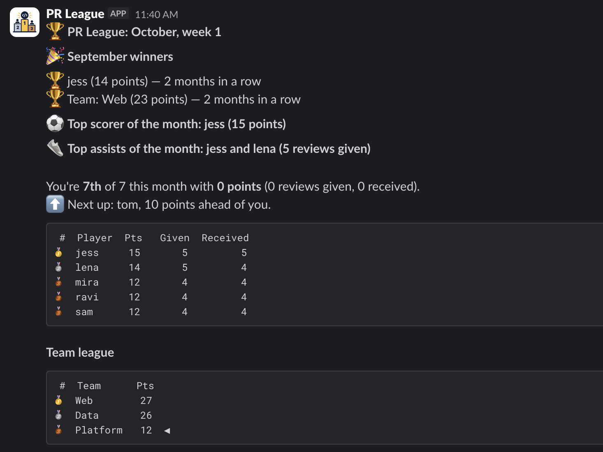

# PR League

A Slack bot that turns pull request reviews, and Jira ticket progress, into a monthly league. It reads a GitHub org's reviews for the current month, scores a roster of players and teams, and DMs each player a match report. Jira ticket scoring is built but stubbed (see below).



*The example above is generated from stubbed data by `send_test_dm.py`.*

## How scoring works

| Event | Points |
|-------|--------|
| A review you give | 2 |
| A review you receive on your PR | 1 |
| Moving a Jira ticket to QE check run | 2 |
| Moving a Jira ticket to Ready for production | 2 |
| Moving a Jira ticket to Closed | 3 |

- Each (reviewer, PR) pair counts once, however many reviews or replies the reviewer leaves on that PR.
- Self-reviews score nothing.
- People not on the roster score nothing, but the other side of their review still can.
- Ties share a position and the next position is skipped (1, 1, 3).
- A team's score is the sum of its members' points.
- Ticket points go to whoever moved the ticket, not the assignee. Each (person, ticket, status) counts once, so reopening and re-closing scores nothing extra. A ticket that passes through all three statuses earns for each.
- **Jira is stubbed for now.** Ticket scoring and rendering are implemented and tested, but real runs don't read Jira yet, so `uv run pr-league` scores PR reviews only. The design, and what is deferred, is in `docs/superpowers/specs/2026-10-07-jira-scoring-design.md`.

## What the notification contains

- **Winners** of the previous month (player and team, with "N months in a row" streaks). Shown on runs in the first 7 days of a month.
- **Top scorer** of the month so far (most points).
- **Top assists** of the month so far (most reviews given).
- **Ticket wizard** of the month so far (most points from Jira tickets). Left out when nobody has ticket points. Demo script only for now.
- Your position, points, and the gap to the next player up.
- The top three players and the top three teams. Ties for third are all shown. The player table gains a Tickets column when anyone in it has ticket points.
- **This week in Jira** and **This month in Jira**, at the bottom: the tickets you moved this week (Monday to now, within the month) and this calendar month, per status, with the points they earned. Shown on Fridays. Demo script only for now.

The league covers the current calendar month and is recomputed from GitHub on every run, so there are no scores to store or reset. The only stored data is the roster of teams, kept in DynamoDB.

## Setup

Requires Python 3.12 and [uv](https://docs.astral.sh/uv/).

```bash
uv sync
cp .env.example .env
```

You also need AWS credentials that can reach the teams table (for example `aws sso login`, then export `AWS_PROFILE`). The table itself is created by Terraform; see [Infrastructure](#infrastructure).

**`.env`**

| Variable | What it is |
|----------|------------|
| `GITHUB_ORG` | The GitHub org whose reviews are scored. |
| `PR_LEAGUE_TABLE` | The DynamoDB teams table, normally `pr-league-teams`. |
| `AWS_REGION` | `eu-west-2`. |
| `GITHUB_TOKEN` | A personal access token with read access to the org's repos. If the org uses SSO, authorise the token for it or every count comes back 0. |
| `SLACK_BOT_TOKEN` | A bot token (`xoxb-...`) for a Slack app with the `chat:write` scope, installed to your workspace. |

`.env` is gitignored.

## Managing teams

Teams and their members live in DynamoDB, one item per team. Edit them with `pr-league-admin`:

```bash
uv run pr-league-admin teams list
uv run pr-league-admin teams add Platform
uv run pr-league-admin members add Platform alexghdev --slack U0123ABCDEF --jira 712020:abc
uv run pr-league-admin members move alexghdev Web
uv run pr-league-admin members remove alexghdev
uv run pr-league-admin teams remove Platform
uv run pr-league-admin import roster.yaml --dry-run   # preview, then run without --dry-run
```

`import` loads a YAML file of `players` (each with `github`, `team`, and optionally `slack` and `jira`; `org` is ignored). It only adds: players already on the right team are skipped, so it is safe to re-run, and existing members are never changed or removed. It stops without writing anything if a player has no team, a login is listed twice, or a login is already on a different team. All the teams are written in one transaction.

- Every player belongs to exactly one team. A GitHub login can't be on two teams (case is ignored).
- `--slack` is the Slack member ID (profile -> ... -> Copy member ID). Without it the player is scored but gets no DM.
- `--jira` is optional and unused until Jira is read for real.
- Each edit is a conditional write, so if two people edit the same team at once, one of them is told to try again rather than silently overwriting the other. `members move` changes both teams in one transaction.
- A run fails before sending anything if the table is empty, a team has no members, or a login is on two teams.

## Running

```bash
uv run pr-league --dry-run   # print every DM instead of sending
uv run pr-league             # send a DM to each player
```

If one DM fails it is logged and the run continues; the process exits non-zero at the end. If the GitHub fetch fails, nothing is sent.

## Try it without GitHub or Jira

`send_test_dm.py` builds the full notification with players, teams and identities from the teams table. `--me <github-login>` says which player you are. Real players take the fixtures' stand-in names, and any leftover stand-ins stay in the league, so a roster of six or more has no fake rivals. Reviews, two months of history and Jira ticket transitions are stubbed. It never contacts GitHub or Jira, so it runs instantly. The Jira blocks show on Fridays, or on any day with `--jira`.

```bash
uv run python send_test_dm.py --me alexghdev --mock                  # print it
uv run python send_test_dm.py --me alexghdev --mock --jira           # include the Jira blocks on any day
uv run python send_test_dm.py --me alexghdev                         # DM yourself
uv run python send_test_dm.py --me alexghdev --channel C0123456789   # post to a channel
```

To post to a channel the bot must be a member of it (`/invite @pr_league` in the channel). Use the channel ID; the `chat:write` scope cannot look channels up by name.

## Tests

```bash
uv run pytest
```

Scoring (reviews and tickets), rendering (including the Jira blocks and the ticket wizard), the GitHub client's retry behaviour, the teams loader and `pr-league-admin` are unit tested. DynamoDB is faked with [moto](https://docs.getmoto.org/), so the tests need no AWS account. The Slack client is checked by hand.

```bash
uv run pytest --cov=pr_league --cov-report=term-missing
```

## Project layout

```
src/pr_league/
  models.py      Player, ReviewEvent, TicketEvent, Standing, TeamStanding, point values
  config.py      load settings and tokens from the environment, and the roster
  roster.py      load and validate the teams table into players
  admin.py       pr-league-admin: edit teams and members, import a roster file
  github.py      fetch review events for the org (retries on connection errors)
  scoring.py     pure: reviews + tickets + roster -> standings, team standings, win streaks
  rendering.py   pure: standings and tickets -> notification text
  slack.py       post a message
  main.py        one run: fetch, score, render, send
docs/adr/         architecture decision records
docs/superpowers/ design specs and implementation plan
infra/            Terraform for the teams table and its IAM policies
```

## Infrastructure

`infra/` creates the teams table (on-demand, point-in-time recovery, deletion protection, encrypted at rest) and two IAM policies: `pr-league-teams-read` for the bot and `pr-league-teams-admin` for whoever runs `pr-league-admin`. Attach them to the right roles yourself; the bot's ECS task role comes with the scheduling work.

The S3 backend is a partial config. Pass the state bucket, key and role for your account at init:

```bash
terraform -chdir=infra init \
  -backend-config="bucket=<state-bucket>" \
  -backend-config="key=pr-league/terraform.tfstate" \
  -backend-config='assume_role={role_arn="arn:aws:iam::<account>:role/TerraformExecutionRole"}'
terraform -chdir=infra plan
```

Why DynamoDB rather than Arbor's default datastores is recorded in `docs/adr/0001-dynamodb-for-the-teams-roster.md`.

## Limitations

- GitHub search returns at most 1,000 PRs. A busy org can exceed that, and a warning is logged when it does; scores will then be low.
- The league is stateless. Winners are only announced for runs in the first 7 days of a month, and streaks are rebuilt by re-scoring up to the last six months, so a run in that window makes several full org fetches.
- Local runs need AWS credentials, because the roster is only in DynamoDB.
- Runs are manual. There is no scheduler, so the Friday Jira blocks need something outside the bot (cron, a GitHub Actions schedule) to run it on Fridays.
- Jira is not read yet. There is no Jira client, no Jira identity per player (the stub matches ticket movers by GitHub login), and no handling for a Jira outage. All of it is listed under Deferred in the Jira spec.
